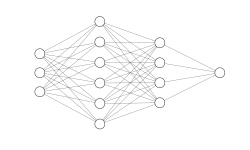
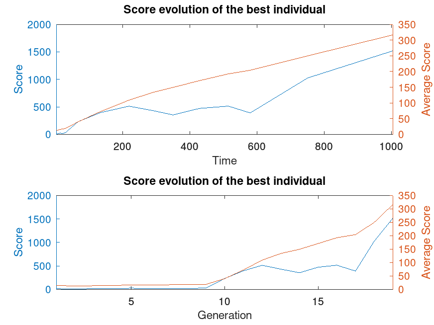

# NEFT for Godot
NeuroEvolution of Fixed Topology library for Godot focused on modularity.

## Setup - Installation
Due to the single inheritance principle in Godot, the setup requires some work but the library has been thought to be as easy as possible to implement.

This part will not teach neuroevolution. I recommend *The Nature Of Code* by Daniel Shiffman (chapter 9 and 10) for that.

<br/>


1. Download this project.
    ```
    git clone https://project
    ```
    Or download and extract the **.zip** archive.

2. Copy the folder `neft_godot` into your project folder.

3. Add an `Organism` Node **as a child** of the object that you want to train.

4. Add a `Population` Node as a child of your training scene.
Specify the object **(.tscn)** that you want to train from the editor inspector: `organism_parent_scene`

5. Tweak the `input_size`, `hidden_layers_sizes` and `output_size` from the editor inspector as needed on the `Organism`

    

    So for this config you'll have:

    - 3 inputs
    - 2 hidden layers: [6, 4]
    - 1 output

<br/>

6. In the object's code that you want to train, **update the fitness** with the methods of `Organism`
    
    - `get_fitness()`
    - `set_fitness(new_fitness)`
    - `add_fitness(amount)`

    <br/>

    example:
    ```
    func _process(delta):
        $Organism.add_fitness(0.1)
    ```

7. Add your own code to define when the population is ready for the next generation (every member has finished training). Then it's as simple as calling:
    ```
    $Population.next_generation()
    ```

    example:
    ```
    func _process(delta):

        var everybody_ready = true
        for child in $Population.get_children():
            if !child.is_ready():
                # at least one child is not ready
                everybody_ready = false
                break
        
        if everybody_ready:
            $Population.next_generation()
            
            # reset the world and children
            # [...]
    ```

8. To take decisions from the neural network of the `Organism`, you have to define the input and give it to the appropriate method:
    ```
    var inputs:Array = []
	inputs.push_back(x1)
	inputs.push_back(x2)
    [...]
	
	var output:Array = $Organism.think(inputs)
    
    # then you can take decisions from the output
    ```
    Note that the input size **must match** the neural network's input size.
    
    Also note that the output is an **array**.

    It's advised to **normalize the inputs** (values between 0 and 1) as much as possible to avoid input issues.

## Example
You can find an example in the `example` folder. Here is some data extracted from the Flappy Bird example. I ran it with
`Engine.time_scale = 2`

`Population size: 200`  
`Mutation rate: 1%`



As you can see, the average best score continuously increases and it slows down until it eventually reaches infinity (not visible here) after enough iterations.